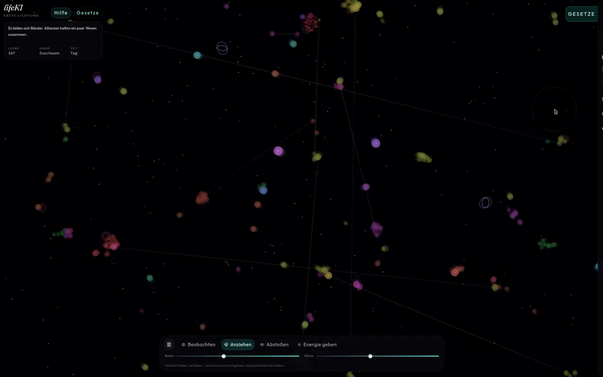

# lifeKI

Particle-Life im Browser. Jedes Licht trägt ein kleines Netz.

**Live:** https://markovigele.github.io/lifeKI/



## Start

```bash
npm install
npm run starten
```

Dann http://127.0.0.1:45221 — auf dem Mac: siehe docs/mac.md.

## Lizenz

MIT · INGENIUMOWL
